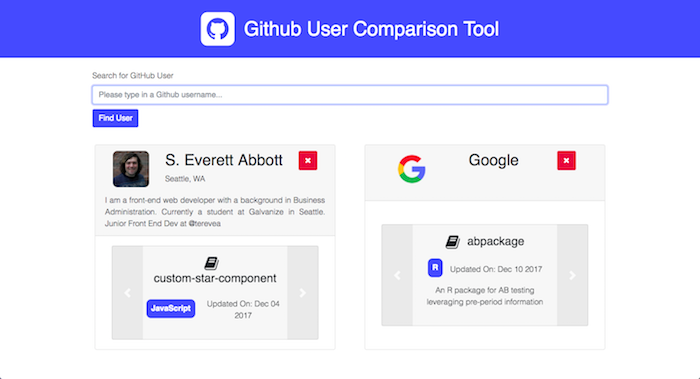

# github-repo-component-vanilla
A Javascript component that lists all your repositories in a visually interesting way. Enter a valid Github username and a card with a user description and all their repositories in a carousel shows up.

## Screenshot

Live Demo: http://github-user-component.surge.sh/

## Synopsis

This project was my Q1 project at the Galvanize Web Development Immersive. The purpose of this project was to be able to compare multiple GitHub users side by side, along with all of their repositories. The initial motivation for this project was to make a dynamic portfolio page that connected directly to my Github profile. This evolved into a basic tool that could be utilized by technical recruiters to view candidates side by side.

## Technology Used

I initially started this project in React.js; however, at the guidance of my instructor, I chose to challenge my knowledge an use pure javascript to build this component.

This project currently uses HTML5/CSS3, Bootstrap, Font Awesome, Javascript (ES6) and Axios.

## Future Features to be Built

- Add sorting features for the UserListComponent, such as by name or location.
- Add additional languages for each of the repositories by leveraging the /{repository}/languages API
- Add a button to save previous searches in localStorage (ex. if the page refreshs, the user does not lose their search parameters.)
- Improve the form validation for non-existent users, not just an empty form.
